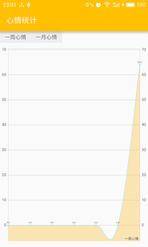

# Emotion-Diary-Android
- 2016年JAVA课HackAll小组大作业
- 本文档由陈乐天编辑（以下部分内容采用第一人称讲述），贡献者包括所有组员

## 项目概述
此项目为Emotion-Diary（情绪日记）的在安卓平台上的版本[Github地址](https://github.com/HackAll-PKU/Emotion-Diary-Android)

### 来源
Emotion-Diary最早是我在参加北京大学2015年举办的黑客马拉松时的一个想法，当时由于时间有限，我和我的小伙伴们只实现了iOS版本的Emotion-Diary。最后展示的时候有很多人都对Emotion-Diary的想法感兴趣，但是有点无奈他们只有安卓手机，没有办法装上。刚好这学期选了JAVA程序设计，经组员们商量后决定我们要实现一个安卓版本的Emotion-Diary

### 环境及使用简介
- Emotion-Diary在Android Studio环境下构建，使用Gradle工具进行包管理和项目打包
- 我们使用了Github作为我们团队协作的工具，毕竟是一个六个人的也算是有点规模的项目，要是没有Git管理。。。分工和合作都够呛。我本身用Github的工作流做了不少项目了，胡顺昕和寇雨婷在另一个项目中我们也用了Github的工作流，另外几位成员或多或少都有一些经验，于是我们就果断采用了Github的工作流，为我们最后的合并省下了很多时间和精力
- 安装简介
	1. 在Android Studio中打开项目
	2. 用USB连接安卓手机并打开USB调试
	3. 戳Android Studio的小绿箭头
	4. 等待
	5. 等待
	6. 等待
	7. Emotion-Diary就装上你的手机啦~
- 使用简介
	1. 刚进入时为解锁界面，此时需要点击中间的图标进行解锁（第一次进入为注册人脸）
	
	2. 拍照后程序会识别拍下来的脸是不是和以前你拍的脸是同一个人（除了第一次进入不需要验证），如果是则开锁，否则返回步骤1
	
	
	
	3. 解锁后可记录心情或查看以前的日记
	4. 记录心情页面会自动捕捉你刚才拍照时候的心情值，当然你也可以手动修改，然后输入日记的内容
	
	5. 然后保存日记
	
	6. 查看以前的日记
	
	7. 查看心情走势
	
	8. 整个应用的色调都会随着你刚开始解锁拍照的那张图片的心情值改变而改变~例如下图的心情走势图色调就和上面的不一样~
	
	9. 感谢胡顺昕同学友情出演~

## 贡献者（按姓名排序）
- 陈乐天
- 胡顺昕
- 寇雨婷
- 刘证源
- 马嬴超
- 温凯

