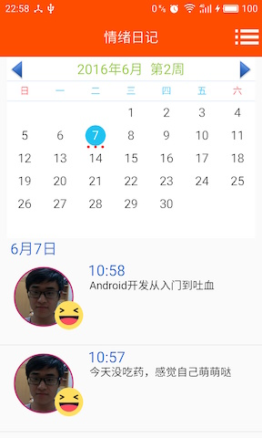

# Emotion-Diary-Android
- 2016年JAVA课HackAll小组大作业
- 本文档由陈乐天编辑（以下部分内容采用第一人称讲述），贡献者包括所有组员

## 项目概述
此项目为Emotion-Diary（情绪日记）的在安卓平台上的版本[Github地址](https://github.com/HackAll-PKU/Emotion-Diary-Android)

### 来源
Emotion-Diary最早是我在参加北京大学2015年举办的黑客马拉松时的一个想法，当时由于时间有限，我和我的小伙伴们只实现了iOS版本的Emotion-Diary。最后展示的时候有很多人都对Emotion-Diary的想法感兴趣，但是有点无奈他们只有安卓手机，没有办法装上。刚好这学期选了JAVA程序设计，经组员们商量后决定我们要实现一个安卓版本的Emotion-Diary

### 环境及使用简介
- Emotion-Diary在Android Studio环境下构建，使用Gradle工具进行包管理和项目打包
- 我们使用了Github作为我们团队协作的工具，毕竟是一个六个人的也算是有点规模的项目，要是没有Git管理。。。分工和合作都够呛。我本身用Github的工作流做了不少项目了，胡顺昕和寇雨婷在另一个项目中我们也用了Github的工作流，另外几位成员或多或少都有一些经验，于是我们就果断采用了Github的工作流，为我们最后的合并省下了很多时间和精力
- 安装简介
	1. 在Android Studio中打开项目
	2. 用USB连接安卓手机并打开USB调试
	3. 戳Android Studio的小绿箭头
	4. 等待
	5. 等待
	6. 等待
	7. Emotion-Diary就装上你的手机啦~
- 使用简介
	1. 刚进入时为解锁界面，此时需要点击中间的图标进行解锁（第一次进入为注册人脸）<br>
	
	2. 拍照后程序会识别拍下来的脸是不是和以前你拍的脸是同一个人（除了第一次进入不需要验证），如果是则开锁，否则返回步骤1<br>
	
	
	
	3. 解锁后可记录心情或查看以前的日记<br>
	4. 记录心情页面会自动捕捉你刚才拍照时候的心情值，当然你也可以手动修改，然后输入日记的内容<br>
	
	5. 然后保存日记<br>
	
	6. 查看以前的日记<br>
	
	7. 查看心情走势<br>
	
	8. 整个应用的色调都会随着你刚开始解锁拍照的那张图片的心情值改变而改变~例如下图的心情走势图色调就和上面的不一样~<br>
	
	9. 感谢胡顺昕同学友情出演~

## 程序介绍
- 本来是按照MVP架构来写的，但是最后由于有些小伙伴时间太紧了没有严格按照架构来，只有Welcome界面是按照MVP架构来写的
- 优点：
	- Model层测试覆盖率100%
	- Model层文档全
	- 具有“主题”切换能力，即不同心情时自动对应不同主题
	- 界面美观（有设计稿）
- 仍可扩展的方面
	- 代码目前耦合有点高，还是要实践MVP架构来完成解耦（且具有丰富的接口结构，易于理解和维护）
	- 部分代码有些混乱，存在拷贝粘贴的情况，应重构
	- 可以拓展社交功能
- 使用的第三方库：
	- Realm（数据存储，陈乐天使用）[https://realm.io](https://realm.io)
	- MPAndroidChart（图表，寇雨婷使用）[https://github.com/PhilJay/MPAndroidChart](https://github.com/PhilJay/MPAndroidChart)
	- 使用Face++的API[Face++](http://www.faceplusplus.com.cn)

## 感想
### 陈乐天
我主要完成了Model层的部分，主要包括与Face++API交互的部分，以及日记的存取、心情值的存取，包括Model层的所有测试代码
#### FaceHelper
- common文件夹下的FaceHelper实现了与Face++API的交互，其使用说明有详细的[文档](./app/src/main/java/org.hackpku.emotiondiary/common/FaceHelper)，接口也有详细注释
- 其测试代码位于[FaceHelperTest.java](./app/src/androidTest/java/org.hackpku.emotiondiary/api/FaceHelperTest.java)，保证测试覆盖率100%

#### Diary部分
- common文件夹下Diary文件夹下的类实现了Diary的存取，包括心情值的存取，其接口有详细的注释
- 测试代码位于[DiaryDataTest.java](./app/src/androidTest/java/org.hackpku.emotiondiary/data/DiaryDataTest.java)，保证测试覆盖率100%

#### 感想
- 这次开发的Model层全部都是我一个人完成的，本来是由两个人来做Model的，前面也说过我上次已经做过iOS端的开发了，所以我对这部分内容会比较熟悉，所以就我一个人来完成了，也算是任务合理分配吧
- 我所做的工作主要就是为所有的界面提供接口，无论是面向网络（Face++的接口）还是面向本地（存储），虽然我的工作不涉及到界面，但是我也要思考界面层的同学们怎么样调这个接口才能够更加舒服，让时间精力更少地花费在要接口、互调、交流上面，所以我不仅有精心设计的接口，也有非常丰富的注释和文档，让调用者不费什么时间就可以轻松获取到我写好的服务。保证测试覆盖率100%也避免了了后面界面层调用我的接口时跟我反映说返回的数据怎么不对啊然后我再去改，再交流的低效率开发
- 在存储方面我采用了Realm，一个移动端非常火的数据库，一方面是看到它的使用用户非常广泛，显然是一个非常成熟的数据库系统，另一方面是考虑到它针对移动端进行了性能和API的优化，所以果断没有使用相对更加难用的sqlite
- 我也是第一次做安卓开发，所以中间遇到了非常多的问题，很多时候都是面向Google和StackOverflow编程，但是这次也积累了不少经验，给同伴们review代码也做了一些界面方面的工作
- 熬夜还是值得的2333

### 胡顺昕
主要完成了欢迎解锁页面和全局主题管理部分
#### 欢迎解锁页面
##### 简介

该部分是此应用的Launcher Activity，主要实现欢迎和自拍解锁的界面和业务逻辑，并对接其他Activities。用户可以通过点按自拍按钮拍摄自己的自拍来解锁应用，软件后台调用相关API去识别人脸并判断是否是本机用户，验证通过后用户可以启动记录心情、进入日记的界面。

##### 界面部分（View）

- 界面部分主要使用到了矢量Drawable的绘制，Drawable的运行时改变（根据人脸识别出的心情值改变Icon颜色），RelativeLayout的运行时measure（通过`ViewTreeObserver.OnGlobalLayoutListener`实现），AlphaAnimation的使用（Icon的呼吸效果），AlertDialog和ProgressDialog的使用与控制等等。
- 图形化界面元素与Android Material Design设计标准相贴合，美观简约。

##### 逻辑部分（Presenter）

- 包括一系列对用户有效性的判断（是否有摄像头、外部存储等必须的硬件、人脸识别与解锁逻辑等），以及界面控制逻辑（在主线程更新界面，而在其他线程进行CPU或IO繁忙的操作），初次使用引导用户创建账户等。
- **可读性强**，变量命名格式和常量定义规范，方法简洁。
- **健壮性强**，多采用卫语句，异常的捕获和抛出比较完善，保证软件入口的安全性。
- **可扩充性强**，采用MVP设计模式，前后端分离；通过持有接口而不是持有类来增强可扩展性。
- 通过Message - Handler模式处理异步事件。线程在CPU或IO繁忙操作结束后，向mHandler发送相关消息，触发界面的更新。

#### 全局主题管理

当识别出用户的心情或用户通过拖动滑条设置心情后，整个APP的主题色会随之改变（忧郁蓝/普通黄/开心橙）。为此，我实现了一个全局主题管理机制：

- 在APP的主Application`MainApplication`类中，定义了`smiling`变量（用于全局保存心情值）和三个Theme常量。
- 所有心情值的改变，会同步到MainApplication中
- 所有Activity的onCreate方法中，通过`MainApplication`中定义的方法取得当前主题，并设置为自身主题，如：

```java
setTheme(((MainApplication) getApplication()).getThemeId());
```
- 在某些Activity的onStart方法中，判断心情值的变化，必要时重新载入当前Activity以实现主题的动态改变。

```java
@Override
protected void onStart() {
   super.onStart();
   if (currentTheme != ((MainApplication)getApplication()).getThemeId()){
       Intent intent = getIntent();
       overridePendingTransition(0, 0);
       intent.addFlags(Intent.FLAG_ACTIVITY_NO_ANIMATION);
       finish();
       overridePendingTransition(0, 0);
       startActivity(intent);
   }
}
```

### 寇雨婷
第一次写安卓开发，真的很艰苦，几乎是面向StackOverFlow编程。。
我主要负责心情统计这部分。
这个页面主要功能是将一个月心情或者一周心情汇成图表展现给用户看。最难的是页面转换和调用第三方库MPAndroidChart。利用Button来进行图表呈现内容的调换。
在队友和Google的帮助下艰难地学习着安卓开发的View-Presenter-Activity的框架逻辑，并第一次尝试用Intent激发Activity进行换页。
第三方库MPAndroidChart功能很强大，能够实现很多很精美的图表，还有很强大的功能。通过在Build.Gradle引入第三方库后，就可以实现我们现在这么精美的图表了。我们还通过修饰实现了可触摸可转变大小的活动图表。

发现掌握一门java后还能写出安卓APP，看着它第一次在手机上运行起来的时候真的很激动。获得了老师的赞赏和认同我们特别感动，觉得考试周一周的夜没有白刷。

### 刘证源
我主要完成主界面（HomePage）的编写，这个界面功能在于显示一个日历，通过点击日期，可以获取和展示当天的所有日记。我主要工作是写了一些自定义控件，包括TitleView（标题栏），RoundImageView（圆形图片控件），DiaryOutlineView（日记概览控件），以及CalendarView（日历控件），并写了相应的布局xml文件，并把这些控件组织成了HomePageActivity。其中比较困难的部分是由于Android的ListView控件功能比较单薄，需要进行改写才能完成添加自定义控件和展示内存图。日历控件和圆形图片控件参考学习了网上的代码，并按照我们程序的要求进行了相应的修改。
经过这次大作业，我第一次体验了手机应用的开发，在巩固了java语言的同时也算接触和学习了一门新的编程语言。
参考代码
http://www.open-open.com/lib/view/open1418871189839.html
http://www.jcodecraeer.com/a/anzhuokaifa/androidkaifa/2015/0930/3538.html

### 马嬴超
RecordEmotionActivity 和 ShowDiaryActivity 由我完成。

其中 RecordEmotionActivity 记录用户输入的日记、照片、题图和心情，提供文本框、照片获取器和滑动选择器完成这项输入。调用 Diary 类来生成日记的一个实例，调用 DiaryHelper 类来将日记保存在内部存储。

这个活动的主题受到 trackBar 的回应。根据 trackBar 的数据，主题会在三种颜色中切换。题图是满宽的图片，从上一活动的图像中获取，心情的默认值从上一活动的图像计算得到。题图只有一张而不可改变，照片存储在 ArrayList<Bitmap> 当中，可以有多张，并且是可选的。

RecordEmotionActivity 的动作栏上有完成按钮。点击后，将调用 DiaryHelper 类生成一个日记，保存在内部存储中。

ShowDiary 显示用户从列表中选择的日记，主题受到心情值的回应，采取 progressBar 展示这一数值。

展示的过程中采用了 Google 推荐的设计方法，采用 ToolBar 作为 ActionBar 以增强兼容性。

### 温凯
见[./introduction-resource/Emotion-diary UI设计稿.docx](./introduction-resource/Emotion-diary UI设计稿.docx)


## 贡献者（按姓名排序）
- 陈乐天 sunshinecltzac@gmail.com
- 胡顺昕 s.hu@pku.edu.cn
- 寇雨婷 yutingkou@pku.edu.cn
- 刘证源 liuzhengyuan1995@pku.edu.cn
- 马嬴超 i@yingchao.ma
- 温凯


