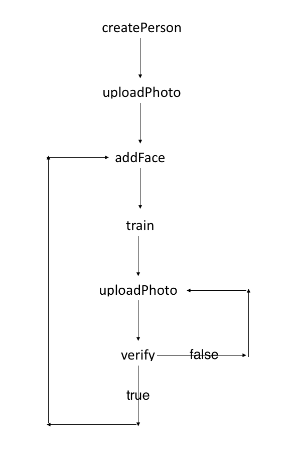

# FaceHelper
## 使用流程图:

## 注意事项
- FaceHelper采用单例模式，使用`FaceHelper.getInstance()`来获取单例
- throw的错误要catch并在视图中给予反馈
- train()接口非瞬间完成，而是API返回一个session_id，服务端会进行train但所需时间不可知，所以train()调用完之后并不是train()结束了，但这一般情况下不影响使用（verify时使用上一次train的结果）

## 测试
- 测试文件位于app/src/androidTest/java/org.hackpku.emotiondiary/api/FaceHelperTest.java
- 测试时testVerify为train留出5s时间，一般情况下已经够用但不排除api繁忙导致testVerify测试通不过的情况，若因此原因未通过测试可再次尝试

## Authored by 陈乐天
